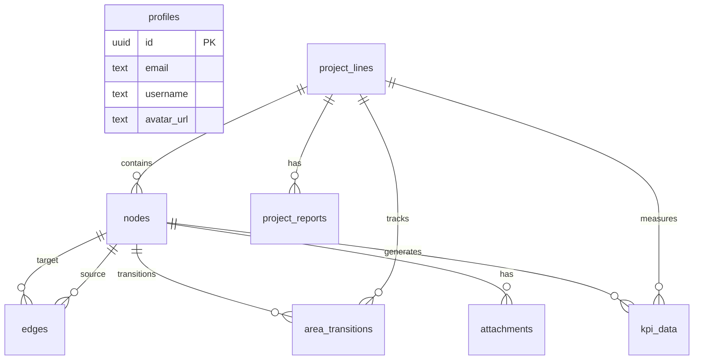

# ParallelLean 統合仕様書

## 目次

1. [概要](#概要)
2. [技術スタック](#技術スタック)
3. [システムアーキテクチャ](#システムアーキテクチャ)
4. [データベース設計](#データベース設計)
5. [グラフビジュアライゼーション設計](#グラフビジュアライゼーション設計)
6. [MDファイル管理](#mdファイル管理)
7. [実装計画](#実装計画)
8. [セキュリティとパフォーマンス](#セキュリティとパフォーマンス)

---

## 概要

ParallelLeanは、チームが共同でリーンスタートアップを並列実行するための共有ワークスペースです。Obsidianのグラフビューをベースに、5つのエリア（KnowledgeBase、IdeaStock、Build、Measure、Learn）を通じてアイデアからMVPまでの流れを視覚的に管理します。

### 主な特徴

- **共有ワークスペース**: 全ユーザーが同一のデータを操作・編集可能
- **グラフベースのUI**: ノードとエッジによる直感的な情報管理
- **5つのエリア**: リーンスタートアップのフローに対応した段階的管理
- **垂直線（プロジェクトライン）**: 複数プロジェクトの並列進行
- **リアルタイム同期**: Supabase Realtimeによる即時反映
- **MDエディタ統合**: 各ノードでMarkdown編集が可能
- **コラボレーション**: 複数ユーザーが同時に作業可能

---

## 技術スタック

### フロントエンド

- **フレームワーク**: Next.js 14 (App Router)
- **グラフビジュアライゼーション**:
  - D3.js v7（物理演算）
  - Konva.js（Canvas描画とインタラクション）
- **MDエディタ**: CodeMirror 6
- **スタイリング**: Tailwind CSS + CSS Modules
- **状態管理**:
  - Zustand（グローバル状態）
  - Valtio（グラフの詳細状態）

### バックエンド

- **データベース**: Supabase (PostgreSQL)
- **リアルタイム**: Supabase Realtime
- **ストレージ**: Supabase Storage（添付ファイル用）
- **API**: Next.js API Routes + tRPC（型安全性）
- **認証**: Supabase Auth

### 開発環境

- **言語**: TypeScript
- **パッケージマネージャー**: pnpm
- **リンター/フォーマッター**: ESLint + Prettier
- **デプロイ**: Vercel

---

## システムアーキテクチャ

### ディレクトリ構造

```
parallel-lean/
├── src/
│   ├── app/                    # Next.js App Router
│   │   ├── api/               # API Routes
│   │   ├── (auth)/            # 認証ページ
│   │   └── (main)/            # メインアプリ
│   ├── components/
│   │   ├── graph/             # グラフ関連コンポーネント
│   │   ├── editor/            # MDエディタ
│   │   └── ui/                # 共通UIコンポーネント
│   ├── lib/
│   │   ├── supabase/          # Supabaseクライアント
│   │   ├── d3/                # D3.js関連
│   │   └── storage/           # ファイル管理
│   ├── hooks/                 # カスタムフック
│   ├── types/                 # 型定義
│   └── stores/                # 状態管理
├── supabase/
│   ├── migrations/            # DBマイグレーション
│   └── schema.sql             # スキーマ定義
└── public/                    # 静的ファイル
```

### コンポーネント階層

```
App
├── Layout
│   ├── Header
│   └── MainView
│       ├── GraphView
│       │   ├── ForceGraph
│       │   │   ├── Node
│       │   │   └── Edge
│       │   └── AreaDividers
│       ├── MDEditor
│       │   ├── EditorToolbar
│       │   └── EditorContent
│       └── Dashboard (将来実装)
└── Modals
    ├── NodeCreateModal
    ├── ProjectConfigModal
    └── ConfirmationModal
```

---

## データベース設計

### 設計思想

1. **共有データモデル**: 全ユーザーが同一のデータセットを操作
2. **エリアベースの階層構造**: 5つのエリアを明確に分離
3. **プロジェクトラインの独立性**: 各プロジェクトは独立した垂直線
4. **ノードの汎用性**: 全ノードタイプを単一テーブルで管理
5. **リアルタイム性**: Supabaseのリアルタイム機能を活用
6. **拡張性**: 将来の機能追加を考慮

### ENUM型定義

#### node_type（ノードタイプ）

| 値            | 説明                 | 存在可能エリア |
| ------------- | -------------------- | -------------- |
| `memo`        | ナレッジベースのメモ | knowledge_base |
| `kb_tag`      | KnowledgeBaseのタグ  | knowledge_base |
| `proposal`    | MVP企画書            | idea_stock     |
| `research`    | リサーチ結果         | idea_stock     |
| `is_tag`      | IdeaStockのタグ      | idea_stock     |
| `task`        | 実装タスク           | build          |
| `mvp`         | 完成したMVP          | measure, learn |
| `dashboard`   | KPIダッシュボード    | measure, learn |
| `improvement` | 改善点               | learn          |

#### area_type（エリアタイプ）

| 値               | 説明             | 段階       |
| ---------------- | ---------------- | ---------- |
| `knowledge_base` | ナレッジベース   | 情報収集   |
| `idea_stock`     | アイデアストック | アイデア化 |
| `build`          | 構築             | 実装       |
| `measure`        | 計測             | データ収集 |
| `learn`          | 学習             | 分析・改善 |

#### project_status（プロジェクトステータス）

| 値           | 説明         | 遷移条件               |
| ------------ | ------------ | ---------------------- |
| `idea_stock` | アイデア段階 | 初期状態               |
| `build`      | 構築中       | タスク追加時           |
| `measure`    | 計測中       | 全タスク完了時（自動） |
| `learn`      | 学習段階     | 計測期間終了時（自動） |
| `pivot`      | 再構築       | ユーザー選択           |
| `shutdown`   | 撤退         | ユーザー選択           |
| `archived`   | アーカイブ   | ユーザー選択           |

### 主要テーブル

#### profiles（ユーザープロファイル）

```sql
CREATE TABLE profiles (
  id UUID PRIMARY KEY REFERENCES auth.users(id),
  email TEXT UNIQUE NOT NULL,
  username TEXT,
  avatar_url TEXT,
  created_at TIMESTAMPTZ DEFAULT NOW(),
  updated_at TIMESTAMPTZ DEFAULT NOW()
);
```

#### project_lines（プロジェクトライン）

```sql
CREATE TABLE project_lines (
  id UUID PRIMARY KEY DEFAULT gen_random_uuid(),
  title TEXT NOT NULL,
  x_position FLOAT NOT NULL, -- 横方向の位置
  status project_status NOT NULL DEFAULT 'idea_stock',
  measurement_period_days INTEGER DEFAULT 30,
  measurement_start_date TIMESTAMPTZ,
  measurement_end_date TIMESTAMPTZ GENERATED ALWAYS AS (...) STORED,
  created_at TIMESTAMPTZ DEFAULT NOW(),
  updated_at TIMESTAMPTZ DEFAULT NOW()
);
```

#### nodes（ノード）

```sql
CREATE TABLE nodes (
  id UUID PRIMARY KEY DEFAULT gen_random_uuid(),
  type node_type NOT NULL,
  area area_type NOT NULL,
  title TEXT NOT NULL,
  content TEXT, -- MDコンテンツ
  position JSONB DEFAULT '{"x": 0, "y": 0}',
  project_line_id UUID REFERENCES project_lines(id) ON DELETE CASCADE,
  vertical_order INTEGER, -- 垂直線上での順序
  branch_id TEXT, -- 分岐識別子
  size INTEGER DEFAULT 50, -- Memoノードのサイズ
  task_status task_status, -- Task専用
  inherited_kb_tags TEXT[], -- 継承されたKBTag
  created_at TIMESTAMPTZ DEFAULT NOW(),
  updated_at TIMESTAMPTZ DEFAULT NOW()
);
```

#### edges（エッジ）

```sql
CREATE TABLE edges (
  id UUID PRIMARY KEY DEFAULT gen_random_uuid(),
  source_id UUID NOT NULL REFERENCES nodes(id) ON DELETE CASCADE,
  target_id UUID NOT NULL REFERENCES nodes(id) ON DELETE CASCADE,
  type edge_type NOT NULL,
  is_branch BOOLEAN DEFAULT FALSE,
  is_merge BOOLEAN DEFAULT FALSE,
  branch_from TEXT,
  merge_to TEXT,
  created_at TIMESTAMPTZ DEFAULT NOW()
);
```

#### attachments（添付ファイル）

```sql
CREATE TABLE attachments (
  id UUID PRIMARY KEY DEFAULT gen_random_uuid(),
  node_id UUID NOT NULL REFERENCES nodes(id) ON DELETE CASCADE,
  file_name TEXT NOT NULL,
  file_type TEXT NOT NULL,
  file_size INTEGER NOT NULL CHECK (file_size > 0),
  storage_path TEXT NOT NULL,
  created_at TIMESTAMPTZ DEFAULT NOW()
);
```

### ER図



### トリガーと自動化

1. **更新時刻の自動更新**: `updated_at`フィールドの自動更新
2. **Memoノードのサイズ自動計算**: コンテンツ文字数に応じた動的サイズ
3. **プロジェクトステータスの自動進行**: 全タスク完了時にMeasureへ自動遷移

---

## グラフビジュアライゼーション設計

### レイアウトエンジン

エリアごとに異なる物理制約を適用する独自のレイアウトエンジンを実装：

```typescript
interface LayoutEngine {
  areaConstraints: {
    knowledge_base: FreeLayoutConstraint // 自由配置
    idea_stock: VerticalLineConstraint // 垂直線制約
    build: BranchingVerticalConstraint // 分岐可能な垂直線
    measure: VerticalLineConstraint // 垂直線制約
    learn: VerticalWithDiagonalConstraint // 垂直線＋斜め配置
  }
  projectLines: Map<string, ProjectLine>
  updateLayout(): void
  animateTransition(node: Node, fromArea: Area, toArea: Area): void
}
```

### ノードスタイル

| ノードタイプ      | スタイル                               |
| ----------------- | -------------------------------------- |
| Memo              | 黒枠線・白パディング・サイズ可変       |
| Proposal/Research | 黒枠線・右上がり斜線パディング         |
| Task              | 黒枠線・状態によって色変化（緑/赤/黄） |
| MVP               | 黒枠線・金フィリング・後光エフェクト   |
| Dashboard         | 黒枠線・内部にグラフアイコン           |
| Improvement       | 黒枠線・白フィリング                   |

### 画面構成

#### 1. グラフビュー（メイン画面）

- **概要**: Obsidianのグラフビューをベースに実装
- **レイアウト**:
  - 画面全体を横線で5分割（KnowledgeBase、IdeaStock、Build、Measure、Learn）
  - 各エリアは同一空間上、同一画面上に存在
  - エリア境界線は視覚的に区別（薄いグレーの横線）

#### 2. MDエディタ

- **概要**: 各ノードのコンテンツ編集用
- **表示方法**:
  - グラフビューの右側にサイドパネルとして表示
  - トグルボタンで開閉可能
  - 画面幅の30-40%を占有
- **機能**:
  - Markdownのシンタックスハイライト
  - リアルタイムプレビュー
  - 自動保存（入力後1秒）
  - 画像アップロード対応

#### 3. ダッシュボード

- **概要**: KPIデータの可視化画面
- **表示方法**:
  - モーダルウィンドウまたは新規タブで表示
  - Dashboardノードクリックで起動
- **機能**:
  - CSVデータのインポート
  - グラフ（折れ線、棒、円）の自動生成
  - データテーブル表示
  - エクスポート機能（PNG、CSV）

### ノードの詳細スタイル

| ノードタイプ      | 枠線          | 背景/パディング                                      | サイズ                           | 特殊効果                         |
| ----------------- | ------------- | ---------------------------------------------------- | -------------------------------- | -------------------------------- |
| Memo              | 黒・実線・2px | 白背景                                               | 可変（50-200px）                 | なし                             |
| KBTag/ISTag       | 黒・実線・2px | 黒塗りつぶし                                         | 固定（60px）                     | なし                             |
| Proposal/Research | 黒・実線・2px | 右上がり斜線パターン                                 | Proposal: 80px<br>Research: 60px | なし                             |
| Task              | 黒・実線・2px | 状態により可変<br>完了: 緑<br>未完了: 赤<br>保留: 黄 | 固定（70px）                     | なし                             |
| MVP               | 黒・実線・3px | 金色（#FFD700）                                      | 固定（100px）                    | 後光エフェクト<br>（box-shadow） |
| Dashboard         | 黒・実線・2px | 白背景                                               | 固定（80px×80px）                | 内部にグラフアイコン             |
| Improvement       | 黒・実線・2px | 白背景                                               | 固定（60px）                     | なし                             |

### ノードの配置ルール

#### KnowledgeBaseエリア

- **Force Simulation**: 標準的な反発力・引力
- **配置**: 完全に自由（ドラッグで任意の位置に移動可能）
- **タグ接続**: KBTagを中心に関連Memoが周囲に配置

#### IdeaStock〜Learnエリア

- **垂直線制約**: プロジェクトラインに沿って垂直に配置
- **Proposal**: 各プロジェクトラインの起点
- **Task**:
  - 基本は垂直線上に上から下へ順番に配置
  - 依存関係により分岐・合流可能
  - 分岐時は左右に枝分かれ
- **MVP/Dashboard**: Measureエリアで横並びに配置
- **Improvement**: MVPから斜め左下45度方向に配置

### インタラクション詳細

#### クリックアクション

| ノードタイプ                                     | アクション                               |
| ------------------------------------------------ | ---------------------------------------- |
| Memo, Proposal, Research, Task, MVP, Improvement | MDエディタを開く（該当コンテンツを表示） |
| KBTag                                            | 接続されているMemoノードをハイライト     |
| ISTag                                            | 接続されているProposalノードをハイライト |
| Dashboard                                        | ダッシュボード画面を開く                 |

#### ドラッグアクション

- **KnowledgeBase**: 自由に移動可能
- **IdeaStock以降**:
  - 横方向のみ移動可能（プロジェクトライン全体が移動）
  - 縦方向は制約あり（エリア内のみ）

#### その他のインタラクション

- **ダブルクリック**:
  - 空白エリア: 新規ノード作成メニュー表示
  - ノード上: 編集モード（タイトル変更）
- **右クリック**: コンテキストメニュー（削除、複製、接続など）
- **ホイール**: ズームイン/アウト（10%-200%）
- **スペース+ドラッグ**: 画面全体のパン
- **Shift+クリック**: 複数ノード選択
- **Delete/Backspace**: 選択ノード削除（確認ダイアログ表示）

### 機能詳細

#### 1. プロジェクトライン生成

- **トリガー**: IdeaStockエリアでProposalノードを作成
- **動作**:
  - Proposalノードから下方向に垂直線が自動的に伸びる
  - 垂直線はBuild、Measure、Learnエリアを貫通
  - 横位置（x_position）は自動または手動で設定

#### 2. ノード間の接続

- **Memo → Proposal**:
  - ドラッグ&ドロップまたは右クリックメニューから接続
  - 参照関係（reference）として記録
- **Node → Tag**:
  - タグ入力時に自動接続
  - 既存タグは自動補完
- **Task間の依存関係**:
  - Shift+ドラッグで依存関係を作成
  - 矢印で視覚化

#### 3. 時間ベースの自動遷移

- **Measure → Learn**:
  - 計測期間終了時に自動実行
  - アニメーション付き（1秒間）
  - MVPとDashboardノードが垂直に降下

#### 4. 計測期間設定UI

- **表示タイミング**: MVPノード生成時
- **UI要素**:
  ```
  計測期間設定
  [30] 日間
  [開始] [キャンセル]
  ```
- **デフォルト**: 30日
- **範囲**: 1-365日

#### 5. 再構築・撤退選択UI

- **表示方法**: Learnエリアで右クリックメニューから選択
- **ダイアログ**:

  ```
  プロジェクトの今後を選択してください

  ○ 継続（そのまま改善を続ける）
  ○ 再構築（ピボット）
  ○ 撤退（シャットダウン）

  [次へ] [キャンセル]
  ```

#### 6. レポート作成機能

- **起動条件**: 再構築または撤退を選択
- **レポート内容**:
  - プロジェクト概要
  - KPIサマリー（グラフ付き）
  - 学習事項（箇条書き）
  - ノードスナップショット（当時の状態）
- **出力形式**: PDF、JSON
- **保存先**: Supabase Storage

#### 7. 追加のコンテンツ管理

- **マーケティング戦略**: MVPノードのcontent内にMarkdownで記述
- **ターゲットインサイト**: 同じくMVPノードのcontent内に専用セクション
- **改善点リスト**: Improvementノードとして個別に作成

### Force Simulationの詳細設定

```javascript
// KnowledgeBaseエリアの設定
const knowledgeBaseSimulation = {
  charge: -300, // ノード間の反発力
  linkDistance: 100, // エッジの理想的な長さ
  collideRadius: 30, // 衝突半径
  centerForce: 0.05, // 中心への引力
  velocityDecay: 0.4, // 速度減衰
}

// 垂直線制約（IdeaStock以降）
const verticalConstraint = {
  xLock: true, // x座標を固定
  yConstraint: 'area', // エリア内のみy方向移動可
  snapToLine: true, // 垂直線にスナップ
}
```

---

## MDファイル管理

### 基本方針

1. **テキストコンテンツ**: `nodes`テーブルの`content`フィールドに直接保存
2. **添付ファイル**: Supabase Storageを活用
3. **リアルタイム同期**: Supabase Realtimeで実現

### ストレージ構造

```
bucket: parallel-lean-files
├── attachments/
│   ├── {node_id}/
│   │   ├── image1.png
│   │   └── document.pdf
└── exports/
    ├── {project_id}_backup.json
    └── {project_id}_report.pdf
```

### セキュリティ

- ファイルサイズ制限: 10MB
- 許可されるファイルタイプ: 画像、PDF、テキストファイル
- Row Level Security: 認証されたユーザーは全ファイルにアクセス可能

---

## 実装計画

### Phase 0: 基礎研究とプロトタイプ（1週間）

- D3.js + Konva.jsの統合検証
- カスタムレイアウトエンジンのプロトタイプ
- 垂直線制約アルゴリズムの実装

### Phase 1: コア基盤（2週間）

- Next.js + Supabase + tRPCセットアップ
- 認証とユーザー管理
- 基本的なDB操作API

### Phase 2: グラフエンジン実装（3週間）

- エリア分割とレイアウト管理
- KnowledgeBaseエリアの自由配置
- 垂直線制約システム
- ノード描画とスタイリング

### Phase 3: KnowledgeBase機能（2週間）

- Memoノード作成・編集
- KBTag自動生成
- サイズ可変実装
- MDエディタ統合

### Phase 4: IdeaStock機能（2週間）

- Proposalノード作成
- Memo→Proposalのリンク
- KBTag継承メカニズム
- ISTag機能

### Phase 5: Build機能（3週間）

- プロジェクトライン生成
- Taskノード配置
- 分岐・合流アルゴリズム
- 状態管理（完了/未完了/保留）

### Phase 6: Measure/Learn機能（2週間）

- 自動遷移システム
- MVPノード生成（後光エフェクト）
- 時間ベース遷移
- Improvementノードの斜め配置

### Phase 7: 高度な機能（2週間）

- エリア間アニメーション
- 再構築・撤退レポート
- 並列プロジェクト管理
- パフォーマンス最適化

### Phase 8: 仕上げ（1週間）

- UXの洗練
- エラーハンドリング
- Vercelデプロイ

---

## セキュリティとパフォーマンス

### セキュリティ設計

#### Row Level Security (RLS)

共有ワークスペースとして、認証されたユーザーは全データにアクセス可能：

```sql
CREATE POLICY "Authenticated users can access all data"
  ON nodes FOR ALL
  USING (auth.role() = 'authenticated');
```

#### 認証フロー

1. Supabase Authによる認証
2. JWTトークンによるセッション管理
3. 認証されたユーザーのみがワークスペースにアクセス可能
4. 全ユーザーが同一のデータセットを共有

### パフォーマンス最適化

#### インデックス設計

```sql
-- ユーザーごとのノード検索高速化
CREATE INDEX idx_nodes_user_id ON nodes(user_id);
CREATE INDEX idx_nodes_type_area ON nodes(type, area);
CREATE INDEX idx_nodes_project_line ON nodes(project_line_id)
  WHERE project_line_id IS NOT NULL;
```

#### グラフ描画の最適化

- Canvas描画（Konva.js）による高速レンダリング
- ビューポート外のノードは描画スキップ
- 段階的なデータロード
- Web Workersによる物理演算のオフロード（検討中）

#### キャッシング戦略

- IndexedDBによるローカルキャッシュ
- Supabaseのリアルタイム機能と組み合わせた差分更新
- 画像の遅延読み込みとサムネイル生成

### 技術的課題と解決策

#### 課題1: エリアごとの異なる物理制約

**解決策**:

- KnowledgeBaseは通常のForce Simulation
- 他エリアはカスタム制約関数を実装
- 毎フレーム制約を適用

#### 課題2: 垂直線上の分岐・合流

**解決策**:

- 有向非巡回グラフ（DAG）として管理
- トポロジカルソートで配置順序決定
- 分岐点で横方向にオフセット

#### 課題3: スムーズなエリア間遷移

**解決策**:

- Web Animations APIを使用
- 中間点を計算してベジェ曲線でアニメーション

#### 課題4: 大量ノードのパフォーマンス

**解決策**:

- 仮想スクロールの実装
- クラスタリングによる表示ノード数の削減
- Progressive Web App化による高速化

---

## 今後の拡張計画

1. **ダッシュボード機能**: KPIの可視化とレポート生成
2. **コラボレーション機能**: チームでのプロジェクト共有
3. **AI支援機能**: タスク提案やインサイト生成
4. **モバイル対応**: レスポンシブデザインの実装
5. **プラグインシステム**: 外部ツールとの連携

---

## まとめ

ParallelLeanは、チームでリーンスタートアップを実践するための共有ワークスペースです。全ユーザーが同一のデータを操作し、リアルタイムで変更が反映されるため、真の協働作業が可能になります。グラフベースのUIと段階的なプロジェクト管理により、複数のアイデアを並列で育てることができ、チーム全体でナレッジとプロジェクトの進捗を共有できます。
