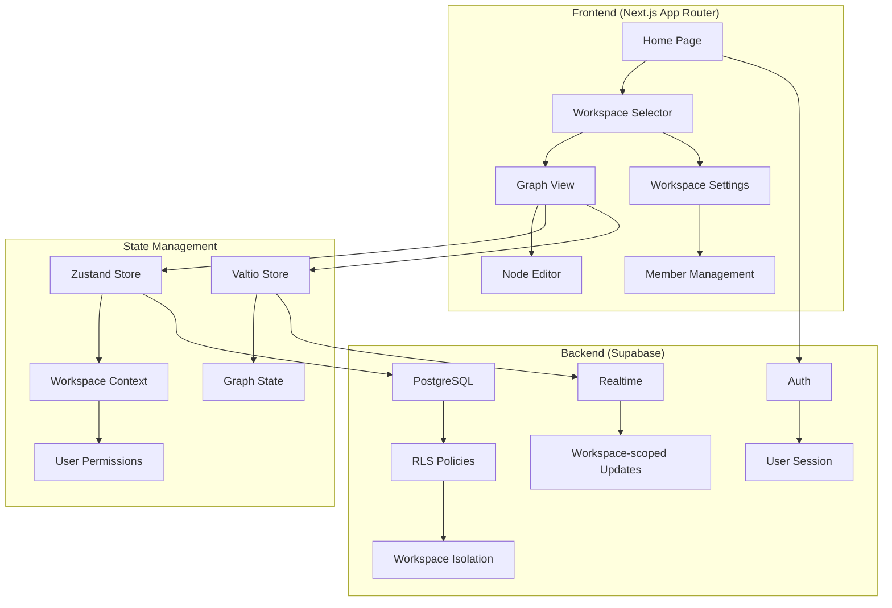
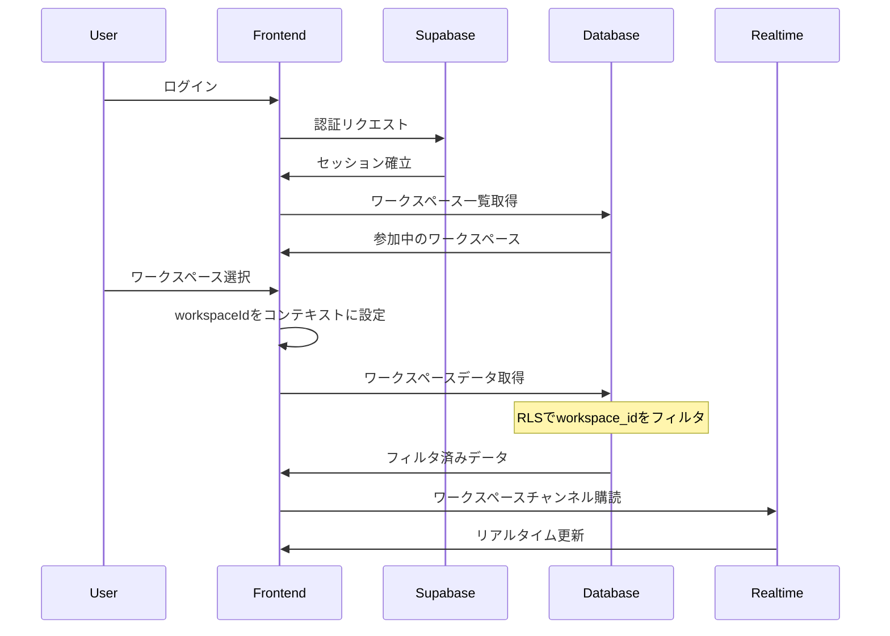
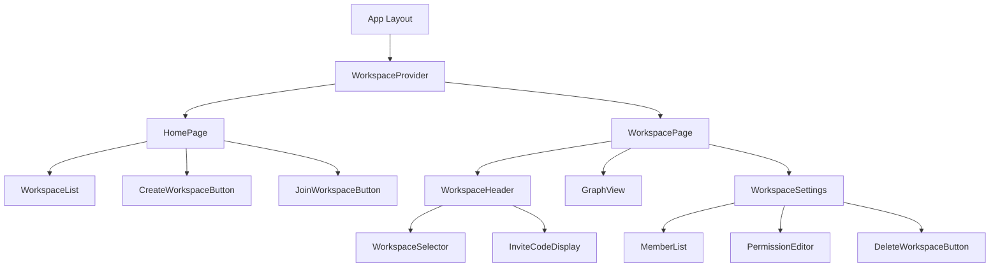

# ParallelLean マルチワークスペース実装設計書

## 1. 概要

このドキュメントは、ParallelLeanにマルチワークスペース機能を実装するための詳細な技術設計を定義します。各ユーザーは1つのワークスペースをオーナーとして作成でき、無制限のワークスペースにメンバーとして参加できます。

## 2. アーキテクチャ概要

### 2.1 システム全体構成



### 2.2 データフロー



## 3. データベース設計

### 3.1 新規テーブル

#### workspaces テーブル
```sql
CREATE TABLE workspaces (
  id UUID PRIMARY KEY DEFAULT gen_random_uuid(),
  name TEXT NOT NULL CHECK (length(name) BETWEEN 1 AND 50),
  owner_id UUID NOT NULL REFERENCES auth.users(id) ON DELETE CASCADE,
  
  -- 招待コード（UUID形式）
  invite_code UUID NOT NULL DEFAULT gen_random_uuid() UNIQUE,
  
  -- メタデータ
  created_at TIMESTAMPTZ DEFAULT NOW(),
  updated_at TIMESTAMPTZ DEFAULT NOW(),
  
  -- 制約：1ユーザー1オーナーワークスペース
  CONSTRAINT one_owner_workspace_per_user UNIQUE(owner_id)
);
```

#### workspace_members テーブル
```sql
CREATE TYPE member_role AS ENUM ('owner', 'member');
CREATE TYPE member_permission AS ENUM ('read_only', 'full_edit', 'area_specific');

CREATE TABLE workspace_members (
  id UUID PRIMARY KEY DEFAULT gen_random_uuid(),
  workspace_id UUID NOT NULL REFERENCES workspaces(id) ON DELETE CASCADE,
  user_id UUID NOT NULL REFERENCES auth.users(id) ON DELETE CASCADE,
  role member_role NOT NULL,
  permission member_permission NOT NULL DEFAULT 'read_only',
  
  -- エリア別権限（permission = 'area_specific'の場合のみ使用）
  area_permissions JSONB DEFAULT '{}' CHECK (
    permission != 'area_specific' OR (
      area_permissions ? 'knowledge_base' AND
      area_permissions ? 'idea_stock' AND
      area_permissions ? 'build' AND
      area_permissions ? 'measure' AND
      area_permissions ? 'learn'
    )
  ),
  
  -- メタデータ
  joined_at TIMESTAMPTZ DEFAULT NOW(),
  last_accessed_at TIMESTAMPTZ DEFAULT NOW(),
  
  -- 制約
  CONSTRAINT unique_member_per_workspace UNIQUE(workspace_id, user_id),
  CONSTRAINT owner_has_full_permission CHECK (
    role != 'owner' OR permission = 'full_edit'
  )
);
```

### 3.2 既存テーブルの修正

#### 全てのデータテーブルにworkspace_idを追加

```sql
-- nodes テーブル
ALTER TABLE nodes ADD COLUMN workspace_id UUID REFERENCES workspaces(id) ON DELETE CASCADE;
ALTER TABLE nodes ALTER COLUMN workspace_id SET NOT NULL;

-- edges テーブル
ALTER TABLE edges ADD COLUMN workspace_id UUID REFERENCES workspaces(id) ON DELETE CASCADE;
ALTER TABLE edges ALTER COLUMN workspace_id SET NOT NULL;

-- project_lines テーブル
ALTER TABLE project_lines ADD COLUMN workspace_id UUID REFERENCES workspaces(id) ON DELETE CASCADE;
ALTER TABLE project_lines ALTER COLUMN workspace_id SET NOT NULL;

-- 他のテーブルも同様に修正
ALTER TABLE area_transitions ADD COLUMN workspace_id UUID REFERENCES workspaces(id) ON DELETE CASCADE;
ALTER TABLE project_reports ADD COLUMN workspace_id UUID REFERENCES workspaces(id) ON DELETE CASCADE;
ALTER TABLE kpi_data ADD COLUMN workspace_id UUID REFERENCES workspaces(id) ON DELETE CASCADE;
ALTER TABLE attachments ADD COLUMN workspace_id UUID REFERENCES workspaces(id) ON DELETE CASCADE;
```

### 3.3 インデックス

```sql
-- ワークスペース検索の高速化
CREATE INDEX idx_workspace_members_user ON workspace_members(user_id);
CREATE INDEX idx_workspace_members_workspace ON workspace_members(workspace_id);
CREATE INDEX idx_workspaces_owner ON workspaces(owner_id);
CREATE INDEX idx_workspaces_invite_code ON workspaces(invite_code);

-- 既存テーブルのworkspace_idインデックス
CREATE INDEX idx_nodes_workspace ON nodes(workspace_id);
CREATE INDEX idx_edges_workspace ON edges(workspace_id);
-- 他のテーブルも同様
```

### 3.4 RLS（Row Level Security）ポリシー

```sql
-- ワークスペーステーブル
CREATE POLICY "Users can view workspaces they belong to"
  ON workspaces FOR SELECT
  USING (
    auth.uid() = owner_id OR
    EXISTS (
      SELECT 1 FROM workspace_members
      WHERE workspace_id = workspaces.id
      AND user_id = auth.uid()
    )
  );

CREATE POLICY "Only owners can update workspace"
  ON workspaces FOR UPDATE
  USING (auth.uid() = owner_id);

CREATE POLICY "Only owners can delete workspace"
  ON workspaces FOR DELETE
  USING (auth.uid() = owner_id);

-- ノードテーブル（例）
CREATE POLICY "Users can view nodes in their workspaces"
  ON nodes FOR SELECT
  USING (
    EXISTS (
      SELECT 1 FROM workspace_members
      WHERE workspace_id = nodes.workspace_id
      AND user_id = auth.uid()
    )
  );

CREATE POLICY "Users can create/update nodes based on permissions"
  ON nodes FOR INSERT
  WITH CHECK (
    EXISTS (
      SELECT 1 FROM workspace_members wm
      WHERE wm.workspace_id = nodes.workspace_id
      AND wm.user_id = auth.uid()
      AND (
        wm.permission = 'full_edit' OR
        (wm.permission = 'area_specific' AND
         (wm.area_permissions->>(nodes.area::text))::boolean = true)
      )
    )
  );
```

## 4. API設計

### 4.1 Supabase Functions（エッジ関数）

#### ワークスペース作成
```typescript
// /supabase/functions/create-workspace
interface CreateWorkspaceRequest {
  name: string
}

interface CreateWorkspaceResponse {
  workspace: {
    id: string
    name: string
    invite_code: string
  }
}

export async function handler(req: Request): Promise<Response> {
  const { name } = await req.json()
  const userId = req.headers.get('x-user-id')
  
  // 既存のオーナーワークスペースチェック
  const existingOwned = await supabase
    .from('workspaces')
    .select('id')
    .eq('owner_id', userId)
    .single()
  
  if (existingOwned.data) {
    return new Response(
      JSON.stringify({ error: '既に1つのワークスペースのオーナーです' }),
      { status: 400 }
    )
  }
  
  // ワークスペース作成
  const workspace = await supabase
    .from('workspaces')
    .insert({ name, owner_id: userId })
    .select()
    .single()
  
  // オーナーをメンバーとして追加
  await supabase
    .from('workspace_members')
    .insert({
      workspace_id: workspace.data.id,
      user_id: userId,
      role: 'owner',
      permission: 'full_edit'
    })
  
  return new Response(JSON.stringify({ workspace: workspace.data }))
}
```

#### ワークスペース参加
```typescript
// /supabase/functions/join-workspace
interface JoinWorkspaceRequest {
  invite_code: string
}

export async function handler(req: Request): Promise<Response> {
  const { invite_code } = await req.json()
  const userId = req.headers.get('x-user-id')
  
  // 招待コードの正規化（ハイフン除去、小文字化）
  const normalizedCode = invite_code.replace(/-/g, '').toLowerCase()
  
  // ワークスペース検索
  const workspace = await supabase
    .from('workspaces')
    .select('id, name')
    .ilike('invite_code', normalizedCode)
    .single()
  
  if (!workspace.data) {
    return new Response(
      JSON.stringify({ error: '無効な招待コードです' }),
      { status: 404 }
    )
  }
  
  // 既存メンバーチェック
  const existing = await supabase
    .from('workspace_members')
    .select('id')
    .eq('workspace_id', workspace.data.id)
    .eq('user_id', userId)
    .single()
  
  if (existing.data) {
    return new Response(
      JSON.stringify({ error: '既にこのワークスペースのメンバーです' }),
      { status: 400 }
    )
  }
  
  // メンバー追加
  await supabase
    .from('workspace_members')
    .insert({
      workspace_id: workspace.data.id,
      user_id: userId,
      role: 'member',
      permission: 'read_only'
    })
  
  return new Response(JSON.stringify({ workspace: workspace.data }))
}
```

### 4.2 クライアントサイドAPI

```typescript
// /app/lib/supabase/workspaces.ts
import { supabase } from './client'

export interface Workspace {
  id: string
  name: string
  owner_id: string
  invite_code: string
  role: 'owner' | 'member'
  permission: 'read_only' | 'full_edit' | 'area_specific'
  area_permissions?: Record<string, boolean>
  last_accessed_at: string
}

export async function getMyWorkspaces(): Promise<Workspace[]> {
  const { data: { user } } = await supabase.auth.getUser()
  
  const { data, error } = await supabase
    .from('workspace_members')
    .select(`
      workspace:workspaces!inner(*),
      role,
      permission,
      area_permissions,
      last_accessed_at
    `)
    .eq('user_id', user.id)
    .order('last_accessed_at', { ascending: false })
  
  if (error) throw error
  
  return data.map(item => ({
    ...item.workspace,
    role: item.role,
    permission: item.permission,
    area_permissions: item.area_permissions,
    last_accessed_at: item.last_accessed_at
  }))
}

export async function updateMemberPermission(
  workspaceId: string,
  memberId: string,
  permission: string,
  areaPermissions?: Record<string, boolean>
): Promise<void> {
  const { error } = await supabase
    .from('workspace_members')
    .update({
      permission,
      area_permissions: areaPermissions
    })
    .eq('workspace_id', workspaceId)
    .eq('user_id', memberId)
  
  if (error) throw error
}
```

## 5. コンポーネント設計

### 5.1 コンポーネント階層



### 5.2 主要コンポーネント

#### WorkspaceProvider
```typescript
// /app/components/providers/WorkspaceProvider.tsx
interface WorkspaceContextValue {
  currentWorkspace: Workspace | null
  setCurrentWorkspace: (workspace: Workspace) => void
  permissions: {
    canEdit: (area?: string) => boolean
    canDelete: () => boolean
    canManageMembers: () => boolean
  }
}

export function WorkspaceProvider({ children }: { children: React.ReactNode }) {
  const [currentWorkspace, setCurrentWorkspace] = useState<Workspace | null>(null)
  
  const permissions = useMemo(() => ({
    canEdit: (area?: string) => {
      if (!currentWorkspace) return false
      if (currentWorkspace.permission === 'full_edit') return true
      if (currentWorkspace.permission === 'read_only') return false
      if (area && currentWorkspace.area_permissions) {
        return currentWorkspace.area_permissions[area] ?? false
      }
      return false
    },
    canDelete: () => currentWorkspace?.role === 'owner',
    canManageMembers: () => currentWorkspace?.role === 'owner'
  }), [currentWorkspace])
  
  return (
    <WorkspaceContext.Provider value={{ currentWorkspace, setCurrentWorkspace, permissions }}>
      {children}
    </WorkspaceContext.Provider>
  )
}
```

#### HomePage
```typescript
// /app/(main)/page.tsx
export default function HomePage() {
  const [workspaces, setWorkspaces] = useState<Workspace[]>([])
  const [showJoinModal, setShowJoinModal] = useState(false)
  const router = useRouter()
  
  useEffect(() => {
    loadWorkspaces()
  }, [])
  
  const loadWorkspaces = async () => {
    const data = await getMyWorkspaces()
    setWorkspaces(data)
  }
  
  const hasOwnedWorkspace = workspaces.some(w => w.role === 'owner')
  
  return (
    <div className="container mx-auto p-6">
      <h1 className="text-3xl font-bold mb-8">ワークスペース</h1>
      
      <div className="grid gap-4 mb-8">
        {workspaces.map(workspace => (
          <WorkspaceCard
            key={workspace.id}
            workspace={workspace}
            onClick={() => router.push(`/workspace/${workspace.id}`)}
          />
        ))}
      </div>
      
      <div className="flex gap-4">
        <Button
          onClick={() => router.push('/workspace/create')}
          disabled={hasOwnedWorkspace}
          title={hasOwnedWorkspace ? '既に1つのワークスペースのオーナーです' : ''}
        >
          オーナーとして新規作成
        </Button>
        
        <Button
          variant="secondary"
          onClick={() => setShowJoinModal(true)}
        >
          メンバーとして参加
        </Button>
      </div>
      
      {showJoinModal && (
        <JoinWorkspaceModal
          onClose={() => setShowJoinModal(false)}
          onSuccess={loadWorkspaces}
        />
      )}
    </div>
  )
}
```

### 5.3 状態管理

#### GraphStore の修正
```typescript
// /app/stores/graphStore.ts
interface GraphStore {
  workspaceId: string | null
  nodes: Node[]
  edges: Edge[]
  // ... 既存のプロパティ
  
  setWorkspace: (workspaceId: string) => void
  loadWorkspaceData: (workspaceId: string) => Promise<void>
  createNode: (node: Partial<Node>) => Promise<void>
  updateNode: (id: string, updates: Partial<Node>) => Promise<void>
  deleteNode: (id: string) => Promise<void>
}

export const useGraphStore = create<GraphStore>((set, get) => ({
  workspaceId: null,
  nodes: [],
  edges: [],
  
  setWorkspace: (workspaceId) => set({ workspaceId }),
  
  loadWorkspaceData: async (workspaceId) => {
    const [nodes, edges] = await Promise.all([
      supabase
        .from('nodes')
        .select('*')
        .eq('workspace_id', workspaceId),
      supabase
        .from('edges')
        .select('*')
        .eq('workspace_id', workspaceId)
    ])
    
    set({
      workspaceId,
      nodes: nodes.data || [],
      edges: edges.data || []
    })
  },
  
  createNode: async (node) => {
    const { workspaceId } = get()
    if (!workspaceId) throw new Error('No workspace selected')
    
    const { data, error } = await supabase
      .from('nodes')
      .insert({ ...node, workspace_id: workspaceId })
      .select()
      .single()
    
    if (error) throw error
    
    set(state => ({
      nodes: [...state.nodes, data]
    }))
  },
  
  // ... 他のメソッドも同様に修正
}))
```

## 6. リアルタイム同期

### 6.1 Workspace スコープのリアルタイム購読

```typescript
// /app/hooks/useWorkspaceRealtime.ts
export function useWorkspaceRealtime(workspaceId: string) {
  const { nodes, edges, addNode, updateNode, deleteNode } = useGraphStore()
  
  useEffect(() => {
    if (!workspaceId) return
    
    // ワークスペース固有のチャンネル
    const channel = supabase
      .channel(`workspace:${workspaceId}`)
      .on(
        'postgres_changes',
        {
          event: '*',
          schema: 'public',
          table: 'nodes',
          filter: `workspace_id=eq.${workspaceId}`
        },
        (payload) => {
          switch (payload.eventType) {
            case 'INSERT':
              addNode(payload.new)
              break
            case 'UPDATE':
              updateNode(payload.new.id, payload.new)
              break
            case 'DELETE':
              deleteNode(payload.old.id)
              break
          }
        }
      )
      .on(
        'postgres_changes',
        {
          event: '*',
          schema: 'public',
          table: 'edges',
          filter: `workspace_id=eq.${workspaceId}`
        },
        (payload) => {
          // エッジの更新処理
        }
      )
      .subscribe()
    
    return () => {
      supabase.removeChannel(channel)
    }
  }, [workspaceId])
}
```

## 7. セキュリティとエラーハンドリング

### 7.1 API レベルのセキュリティ

```typescript
// /app/lib/supabase/middleware.ts
export async function withWorkspaceAccess(
  workspaceId: string,
  requiredPermission?: 'read' | 'write' | 'admin'
) {
  const { data: { user } } = await supabase.auth.getUser()
  if (!user) throw new Error('Unauthorized')
  
  const { data: member } = await supabase
    .from('workspace_members')
    .select('role, permission, area_permissions')
    .eq('workspace_id', workspaceId)
    .eq('user_id', user.id)
    .single()
  
  if (!member) {
    throw new Error('このワークスペースへのアクセス権限がありません')
  }
  
  if (requiredPermission === 'admin' && member.role !== 'owner') {
    throw new Error('この操作を実行する権限がありません')
  }
  
  if (requiredPermission === 'write' && member.permission === 'read_only') {
    throw new Error('このワークスペースでの編集権限がありません')
  }
  
  return member
}
```

### 7.2 フロントエンドのエラーハンドリング

```typescript
// /app/components/ErrorBoundary.tsx
export function WorkspaceErrorBoundary({ children }: { children: React.ReactNode }) {
  const router = useRouter()
  
  return (
    <ErrorBoundary
      fallbackRender={({ error }) => {
        if (error.message.includes('ワークスペースは存在しません')) {
          router.push('/')
          toast.error('アクセスしようとしたワークスペースは存在しません')
          return null
        }
        
        if (error.status === 401) {
          router.push('/')
          return null
        }
        
        return <ErrorFallback error={error} />
      }}
    >
      {children}
    </ErrorBoundary>
  )
}
```

## 8. マイグレーション戦略

### 8.1 既存データの移行

```sql
-- 初期ワークスペース作成（既存データ用）
INSERT INTO workspaces (id, name, owner_id)
SELECT 
  gen_random_uuid(),
  '共有ワークスペース',
  (SELECT id FROM auth.users LIMIT 1)
;

-- 既存データにworkspace_idを設定
UPDATE nodes SET workspace_id = (SELECT id FROM workspaces LIMIT 1);
UPDATE edges SET workspace_id = (SELECT id FROM workspaces LIMIT 1);
-- 他のテーブルも同様

-- 全ユーザーをメンバーとして追加
INSERT INTO workspace_members (workspace_id, user_id, role, permission)
SELECT 
  (SELECT id FROM workspaces LIMIT 1),
  id,
  CASE 
    WHEN id = (SELECT owner_id FROM workspaces LIMIT 1) THEN 'owner'
    ELSE 'member'
  END,
  'full_edit'
FROM auth.users;
```

### 8.2 段階的ロールアウト

1. **Phase 1**: データベーススキーマの更新とマイグレーション
2. **Phase 2**: 認証・権限システムの実装
3. **Phase 3**: UIコンポーネントの実装
4. **Phase 4**: リアルタイム同期の更新
5. **Phase 5**: 既存ユーザーへの通知と移行

## 9. パフォーマンス最適化

### 9.1 クエリ最適化

```typescript
// ワークスペース切り替え時の一括データ取得
export async function loadWorkspaceData(workspaceId: string) {
  const { data, error } = await supabase.rpc('get_workspace_data', {
    p_workspace_id: workspaceId
  })
  
  return {
    nodes: data.nodes,
    edges: data.edges,
    projectLines: data.project_lines,
    members: data.members
  }
}
```

### 9.2 キャッシュ戦略

```typescript
// /app/stores/workspaceCache.ts
interface WorkspaceCache {
  [workspaceId: string]: {
    data: any
    timestamp: number
  }
}

const CACHE_DURATION = 5 * 60 * 1000 // 5分

export const workspaceCache: WorkspaceCache = {}

export function getCachedWorkspaceData(workspaceId: string) {
  const cached = workspaceCache[workspaceId]
  if (cached && Date.now() - cached.timestamp < CACHE_DURATION) {
    return cached.data
  }
  return null
}
```

## 10. テスト戦略

### 10.1 統合テスト

```typescript
// /tests/workspace.test.ts
describe('Workspace Management', () => {
  test('ユーザーは1つのワークスペースのみ作成できる', async () => {
    const user = await createTestUser()
    
    // 最初のワークスペース作成
    const workspace1 = await createWorkspace(user.id, 'Workspace 1')
    expect(workspace1).toBeDefined()
    
    // 2つ目のワークスペース作成は失敗
    await expect(createWorkspace(user.id, 'Workspace 2'))
      .rejects.toThrow('既に1つのワークスペースのオーナーです')
  })
  
  test('メンバーの権限が正しく適用される', async () => {
    const owner = await createTestUser()
    const member = await createTestUser()
    const workspace = await createWorkspace(owner.id, 'Test Workspace')
    
    // メンバー追加（読み取り専用）
    await addMember(workspace.id, member.id, 'read_only')
    
    // ノード作成は失敗
    await expect(createNode(workspace.id, member.id, { type: 'memo' }))
      .rejects.toThrow('編集権限がありません')
  })
})
```

## 11. 監視とログ

### 11.1 メトリクス収集

```typescript
// /app/lib/analytics/workspace.ts
export function trackWorkspaceEvent(
  event: 'created' | 'joined' | 'deleted' | 'permission_changed',
  data: any
) {
  // Supabase Analytics or custom logging
  supabase.from('workspace_events').insert({
    event_type: event,
    workspace_id: data.workspaceId,
    user_id: data.userId,
    metadata: data,
    created_at: new Date()
  })
}
```

## 12. 今後の拡張性

### 12.1 将来的な機能拡張

- **ワークスペーステンプレート**: 事前定義されたノード構造
- **ワークスペース間のデータ共有**: 特定のノードの共有機能
- **高度な権限管理**: ノードレベルの権限設定
- **ワークスペースアーカイブ**: 非アクティブなワークスペースの自動アーカイブ
- **監査ログ**: 全ての操作の記録と履歴

### 12.2 スケーラビリティ

- **データベースパーティショニング**: workspace_idによるパーティション
- **読み取り専用レプリカ**: 読み取り負荷の分散
- **CDN統合**: 静的アセットのキャッシュ
- **エッジ関数の最適化**: リージョン別デプロイ

## まとめ

このマルチワークスペース実装により、ParallelLeanは複数のチームやプロジェクトを独立して管理できるようになります。データの完全な分離、柔軟な権限管理、優れたパフォーマンスを実現しつつ、将来の拡張にも対応できる設計となっています。