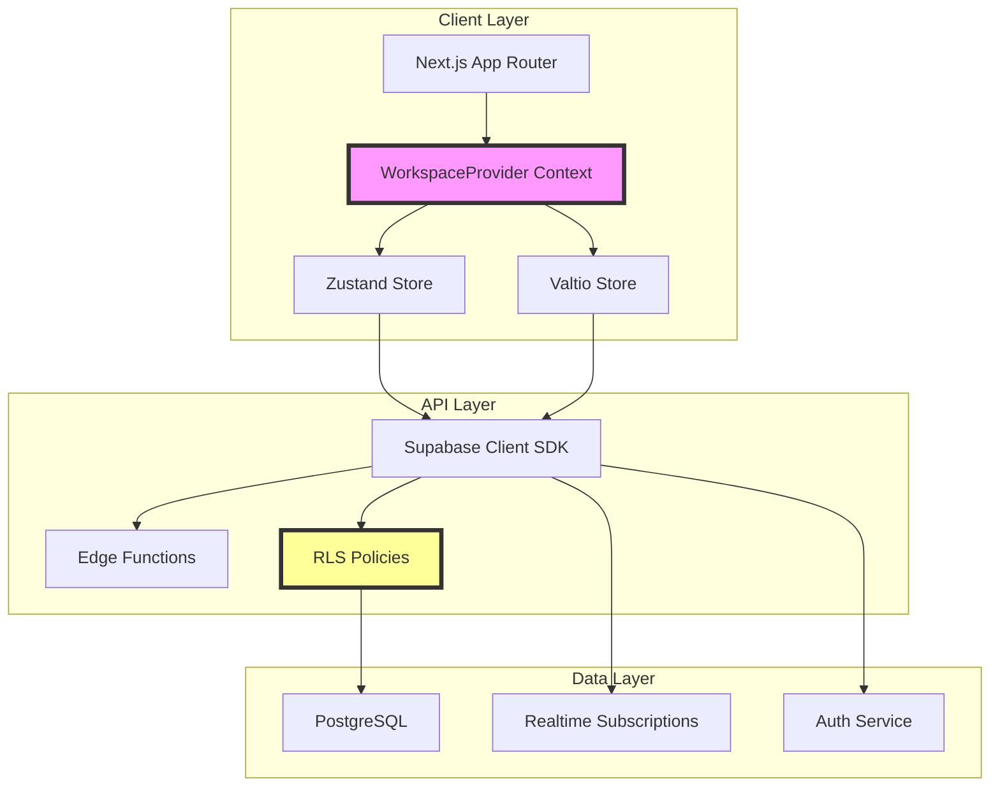
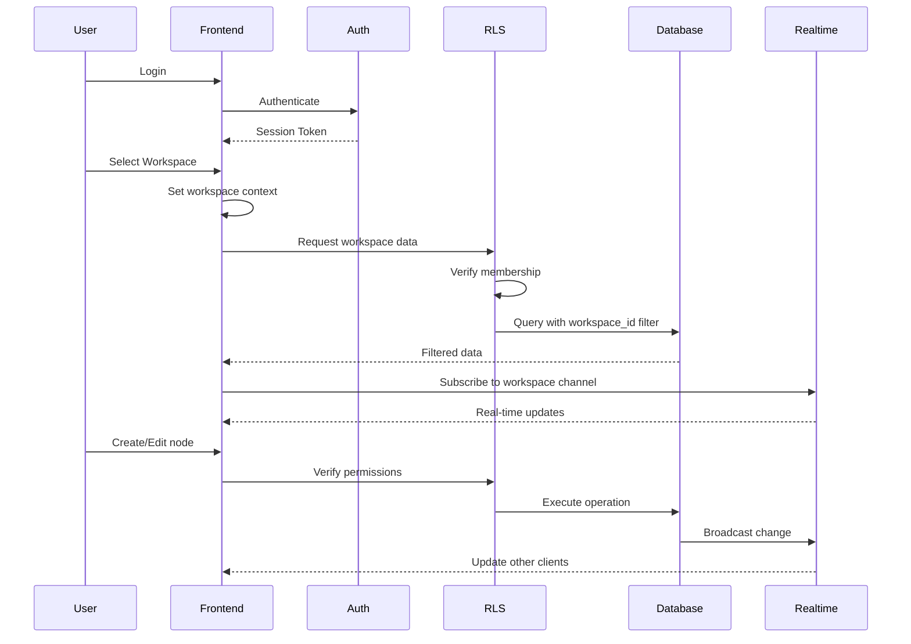
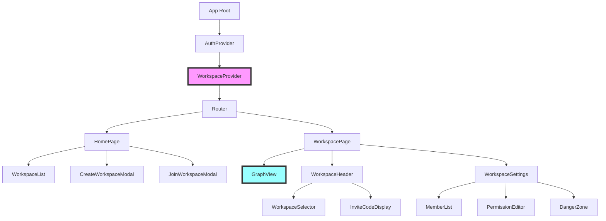
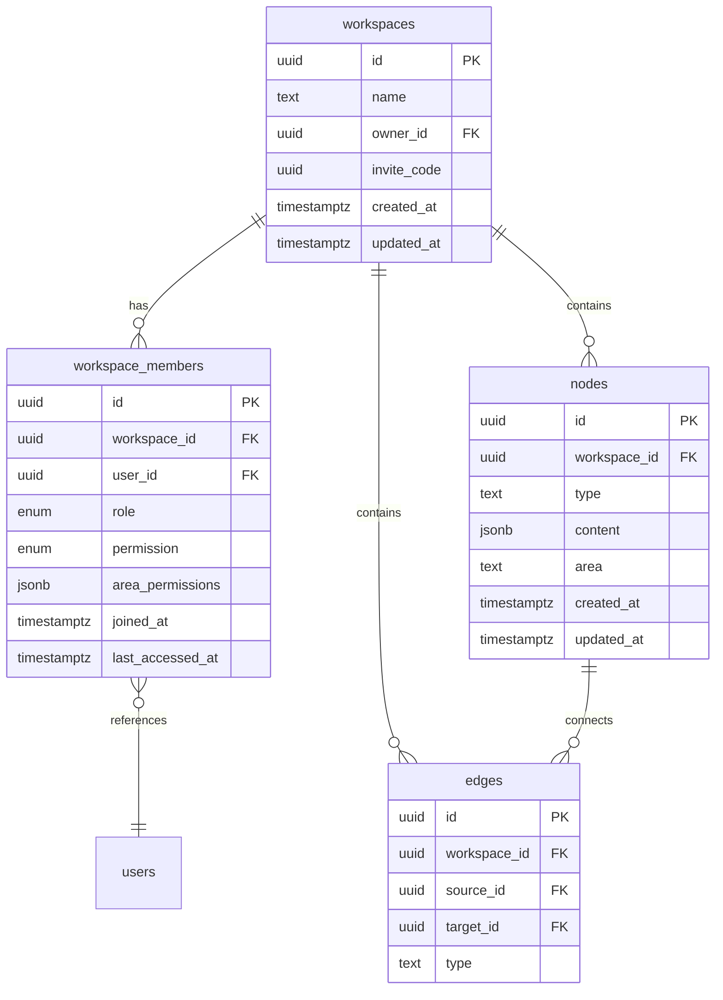

# ParallelLean Multi-Workspace Feature Design Document

## Overview

This document presents the technical design for implementing multi-workspace functionality in ParallelLean. The design enables users to create and manage isolated project environments while maintaining the core graph-based visualization and lean startup methodology workflow.

### Key Design Decisions

1. **One Owner Per User Constraint**: Implemented at the database level to ensure data consistency and simplify ownership management
2. **UUID-based Invite System**: Using workspace UUID as invite code for simplicity and security
3. **Row-Level Security (RLS)**: Leveraging Supabase RLS for data isolation between workspaces
4. **Granular Permission System**: Three-tier permission model (read-only, full-edit, area-specific) for flexible access control
5. **Minimal Migration Impact**: Additive changes to existing schema to preserve current functionality

### Research Findings

- **Supabase RLS Best Practices**: RLS policies provide robust data isolation when properly configured with workspace_id filtering
- **UUID Normalization**: Case-insensitive and hyphen-flexible UUID handling improves user experience
- **Performance Considerations**: Workspace-scoped indexes and connection pooling are critical for multi-tenant performance
- **Real-time Sync**: Supabase Realtime channels can be scoped to workspace level for efficient updates

## Architecture

### System Architecture



### Data Flow Architecture



### Security Architecture

- **Authentication**: Supabase Auth with JWT tokens
- **Authorization**: RLS policies enforce workspace membership and permissions
- **Data Isolation**: All queries automatically filtered by workspace_id
- **Session Management**: 401 responses trigger automatic redirect to home

## Components and Interfaces

### Core Components

```typescript
// WorkspaceProvider Interface
interface IWorkspaceProvider {
  currentWorkspace: Workspace | null;
  permissions: IPermissions;
  setCurrentWorkspace: (workspace: Workspace) => void;
  switchWorkspace: (workspaceId: string) => Promise<void>;
}

// Permission System Interface
interface IPermissions {
  canEdit: (area?: AreaType) => boolean;
  canDelete: () => boolean;
  canManageMembers: () => boolean;
  canUpdateSettings: () => boolean;
}

// Workspace Management Interface
interface IWorkspaceManager {
  createWorkspace: (name: string) => Promise<Workspace>;
  joinWorkspace: (inviteCode: string) => Promise<Workspace>;
  deleteWorkspace: (workspaceId: string) => Promise<void>;
  updateWorkspace: (workspaceId: string, updates: Partial<Workspace>) => Promise<void>;
}

// Member Management Interface
interface IMemberManager {
  addMember: (workspaceId: string, inviteCode: string) => Promise<Member>;
  removeMember: (workspaceId: string, userId: string) => Promise<void>;
  updatePermissions: (workspaceId: string, userId: string, permissions: MemberPermission) => Promise<void>;
  listMembers: (workspaceId: string) => Promise<Member[]>;
}
```

### Component Hierarchy



### Key UI Components

1. **WorkspaceList**: Displays user's workspaces with role indicators
2. **WorkspaceSelector**: Dropdown for quick workspace switching
3. **InviteCodeDisplay**: Shows UUID with copy button and toast feedback
4. **PermissionEditor**: UI for managing member permissions with area-specific controls
5. **MemberList**: Table view with search, filter, and bulk actions

## Data Models

### Database Schema



### Type Definitions

```typescript
// Core Types
type WorkspaceId = string; // UUID
type UserId = string; // UUID
type NodeId = string; // UUID

// Enums
enum MemberRole {
  OWNER = 'owner',
  MEMBER = 'member'
}

enum MemberPermission {
  READ_ONLY = 'read_only',
  FULL_EDIT = 'full_edit',
  AREA_SPECIFIC = 'area_specific'
}

enum AreaType {
  KNOWLEDGE_BASE = 'knowledge_base',
  IDEA_STOCK = 'idea_stock',
  BUILD = 'build',
  MEASURE = 'measure',
  LEARN = 'learn'
}

// Data Models
interface Workspace {
  id: WorkspaceId;
  name: string;
  ownerId: UserId;
  inviteCode: string;
  createdAt: Date;
  updatedAt: Date;
}

interface WorkspaceMember {
  id: string;
  workspaceId: WorkspaceId;
  userId: UserId;
  role: MemberRole;
  permission: MemberPermission;
  areaPermissions?: Record<AreaType, boolean>;
  joinedAt: Date;
  lastAccessedAt: Date;
}

// Extended Node type with workspace
interface WorkspaceNode extends Node {
  workspaceId: WorkspaceId;
}
```

### Database Constraints

1. **One Owner Constraint**: `UNIQUE(owner_id)` on workspaces table
2. **Member Uniqueness**: `UNIQUE(workspace_id, user_id)` on workspace_members
3. **Owner Permission**: CHECK constraint ensuring owners have full_edit permission
4. **Area Permission Validation**: CHECK constraint for area_specific permissions

## Error Handling

### Error Categories and Responses

```typescript
// Error Type Definitions
enum ErrorCode {
  // Workspace Errors
  WORKSPACE_NOT_FOUND = 'WORKSPACE_NOT_FOUND',
  WORKSPACE_ALREADY_OWNED = 'WORKSPACE_ALREADY_OWNED',
  WORKSPACE_ACCESS_DENIED = 'WORKSPACE_ACCESS_DENIED',
  
  // Member Errors
  MEMBER_NOT_FOUND = 'MEMBER_NOT_FOUND',
  MEMBER_ALREADY_EXISTS = 'MEMBER_ALREADY_EXISTS',
  MEMBER_PERMISSION_DENIED = 'MEMBER_PERMISSION_DENIED',
  
  // Invite Errors
  INVITE_CODE_INVALID = 'INVITE_CODE_INVALID',
  INVITE_CODE_EXPIRED = 'INVITE_CODE_EXPIRED',
  
  // Permission Errors
  PERMISSION_INSUFFICIENT = 'PERMISSION_INSUFFICIENT',
  PERMISSION_AREA_RESTRICTED = 'PERMISSION_AREA_RESTRICTED'
}

// Error Handler Implementation
class WorkspaceErrorHandler {
  static handle(error: any): ErrorResponse {
    switch (error.code) {
      case ErrorCode.WORKSPACE_NOT_FOUND:
        return {
          message: 'アクセスしようとしたワークスペースは存在しません',
          action: 'redirect_home',
          statusCode: 404
        };
      
      case ErrorCode.WORKSPACE_ALREADY_OWNED:
        return {
          message: '既に1つのワークスペースのオーナーです',
          action: 'show_toast',
          statusCode: 400
        };
      
      case ErrorCode.PERMISSION_INSUFFICIENT:
        return {
          message: 'この操作を実行する権限がありません',
          action: 'show_toast',
          statusCode: 403
        };
      
      default:
        return {
          message: 'エラーが発生しました',
          action: 'show_toast',
          statusCode: 500
        };
    }
  }
}
```

### Client-Side Error Handling

```typescript
// Global Error Boundary
export function WorkspaceErrorBoundary({ children }: { children: React.ReactNode }) {
  return (
    <ErrorBoundary
      fallbackRender={({ error, resetErrorBoundary }) => {
        const errorResponse = WorkspaceErrorHandler.handle(error);
        
        if (errorResponse.action === 'redirect_home') {
          router.push('/');
          toast.error(errorResponse.message);
          return null;
        }
        
        return (
          <ErrorFallback 
            error={error} 
            resetErrorBoundary={resetErrorBoundary}
            message={errorResponse.message}
          />
        );
      }}
    >
      {children}
    </ErrorBoundary>
  );
}
```

### API Error Responses

All API endpoints return consistent error responses:

```json
{
  "error": {
    "code": "WORKSPACE_NOT_FOUND",
    "message": "ワークスペースが見つかりません",
    "details": {
      "workspaceId": "123e4567-e89b-12d3-a456-426614174000"
    }
  },
  "statusCode": 404
}
```

## Testing Strategy

### Unit Testing

```typescript
// Component Testing Example
describe('WorkspaceProvider', () => {
  it('should provide workspace context to children', () => {
    const workspace = createMockWorkspace();
    const { result } = renderHook(() => useWorkspace(), {
      wrapper: ({ children }) => (
        <WorkspaceProvider initialWorkspace={workspace}>
          {children}
        </WorkspaceProvider>
      )
    });
    
    expect(result.current.currentWorkspace).toEqual(workspace);
  });
  
  it('should calculate permissions correctly', () => {
    const memberWorkspace = createMockWorkspace({ 
      role: 'member', 
      permission: 'area_specific',
      areaPermissions: { knowledge_base: true, idea_stock: false }
    });
    
    const { result } = renderHook(() => useWorkspace(), {
      wrapper: ({ children }) => (
        <WorkspaceProvider initialWorkspace={memberWorkspace}>
          {children}
        </WorkspaceProvider>
      )
    });
    
    expect(result.current.permissions.canEdit('knowledge_base')).toBe(true);
    expect(result.current.permissions.canEdit('idea_stock')).toBe(false);
    expect(result.current.permissions.canManageMembers()).toBe(false);
  });
});
```

### Integration Testing

```typescript
// API Integration Tests
describe('Workspace API', () => {
  it('should enforce one-owner-per-user constraint', async () => {
    const user = await createTestUser();
    
    // Create first workspace
    const workspace1 = await createWorkspace(user.id, 'Workspace 1');
    expect(workspace1).toBeDefined();
    
    // Attempt to create second workspace
    await expect(createWorkspace(user.id, 'Workspace 2'))
      .rejects.toThrow('既に1つのワークスペースのオーナーです');
  });
  
  it('should properly isolate data between workspaces', async () => {
    const user1 = await createTestUser();
    const user2 = await createTestUser();
    
    const workspace1 = await createWorkspace(user1.id, 'Workspace 1');
    const workspace2 = await createWorkspace(user2.id, 'Workspace 2');
    
    // Create node in workspace1
    const node = await createNode(workspace1.id, { type: 'memo', content: 'Test' });
    
    // Verify user2 cannot access workspace1 data
    await expect(getNode(node.id, user2.id))
      .rejects.toThrow('WORKSPACE_ACCESS_DENIED');
  });
});
```

### E2E Testing

```typescript
// Playwright E2E Tests
test.describe('Multi-workspace Flow', () => {
  test('complete workspace creation and invitation flow', async ({ page }) => {
    // Login as owner
    await loginAsTestUser(page, 'owner@test.com');
    
    // Create workspace
    await page.goto('/');
    await page.click('text=オーナーとして新規作成');
    await page.fill('input[name="workspace-name"]', 'Test Workspace');
    await page.click('text=作成');
    
    // Verify workspace created
    await expect(page).toHaveURL(/\/workspace\/.+/);
    
    // Get invite code
    await page.click('text=招待コード');
    const inviteCode = await page.textContent('[data-testid="invite-code"]');
    
    // Login as member in new context
    const memberContext = await browser.newContext();
    const memberPage = await memberContext.newPage();
    await loginAsTestUser(memberPage, 'member@test.com');
    
    // Join workspace
    await memberPage.goto('/');
    await memberPage.click('text=メンバーとして参加');
    await memberPage.fill('input[name="invite-code"]', inviteCode);
    await memberPage.click('text=参加');
    
    // Verify member can access workspace
    await expect(memberPage).toHaveURL(/\/workspace\/.+/);
    await expect(memberPage.locator('[data-testid="workspace-role"]'))
      .toHaveText('メンバー');
  });
});
```

### Performance Testing

```typescript
// Load Testing Scenarios
describe('Workspace Performance', () => {
  it('should handle workspace switching within 3 seconds', async () => {
    const startTime = performance.now();
    await switchWorkspace(workspaceId);
    const endTime = performance.now();
    
    expect(endTime - startTime).toBeLessThan(3000);
  });
  
  it('should efficiently query workspace data with proper indexes', async () => {
    // Verify query plan uses indexes
    const queryPlan = await analyzeQuery(`
      SELECT * FROM nodes 
      WHERE workspace_id = $1 
      ORDER BY created_at DESC 
      LIMIT 100
    `);
    
    expect(queryPlan).toContain('Index Scan using idx_nodes_workspace');
  });
});
```

### Security Testing

1. **Data Isolation Tests**: Verify no cross-workspace data leakage
2. **Permission Tests**: Ensure all permission combinations work correctly
3. **Session Tests**: Verify 401 handling and automatic redirects
4. **SQL Injection Tests**: Validate all inputs are properly sanitized
5. **RLS Policy Tests**: Confirm policies block unauthorized access

## Implementation Considerations

### Migration Strategy

1. **Phase 1**: Deploy database schema changes with backward compatibility
2. **Phase 2**: Deploy API changes with feature flags
3. **Phase 3**: Deploy UI components behind feature flag
4. **Phase 4**: Migrate existing data to default workspace
5. **Phase 5**: Enable feature for all users
6. **Phase 6**: Remove feature flags and old code paths

### Performance Optimizations

1. **Database Indexes**: Create indexes on workspace_id for all tables
2. **Query Optimization**: Use prepared statements and connection pooling
3. **Caching Strategy**: Cache workspace metadata in memory
4. **Real-time Optimization**: Use workspace-specific channels
5. **Lazy Loading**: Load workspace data on demand

### Monitoring and Analytics

1. **Metrics to Track**:
   - Workspace creation rate
   - Member invitation success rate
   - Permission change frequency
   - Error rates by type
   - Performance metrics (query times, API latency)

2. **Logging Strategy**:
   - Log all workspace operations with user context
   - Track permission changes for audit trail
   - Monitor RLS policy violations

### Future Extensibility

The design supports future enhancements:
- Workspace templates
- Advanced permission models (node-level permissions)
- Workspace archiving and restoration
- Cross-workspace data sharing
- Workspace activity feeds
- Bulk member management
- API tokens for workspace access